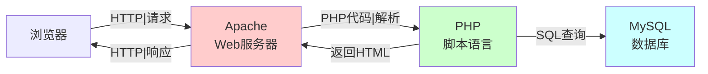
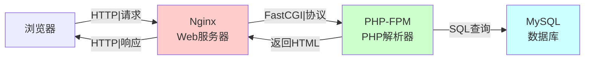

+++
title = "第42章：LAMP/LEMP 环境搭建"
weight = 420
date = "2026-03-24T13:18:28+08:00"
type = "docs"
description = ""
isCJKLanguage = true
draft = false
+++


# 第四十二章：LAMP/LEMP 环境搭建

LAMP和LEMP是搭建动态网站或Web应用的经典架构。L代表Linux操作系统，A/N是Apache/Nginx这两位"看门大爷"，M是MySQL/MariaDB数据库（数据仓库管理员），P是PHP/Python/Perl脚本语言（负责动态生成网页）。

> 本章配套视频：从零开始，30分钟搭好一个能跑WordPress的环境。

## 42.1 LAMP 环境

### 42.1.1 Linux + Apache + MySQL + PHP

LAMP是经典的Web应用架构，每个组件各司其职：



**安装LAMP**：

```bash
# 一条命令安装LAMP（Ubuntu）
sudo apt update
sudo apt install apache2 mariadb-server php libapache2-mod-php php-mysql php-curl php-gd php-mbstring php-xml php-xmlrpc php-zip php-intl php-soap
```

```bash
# 验证PHP是否安装成功
php -v
```

```bash
PHP 8.1.2 (cli) (built: Jan  1 2026 00:00:00) (ZTS)
Copyright (c) 1997-2026 The PHP Group
Zend Engine v4.1.2, Copyright (c), by Zend Technologies
```

```bash
# 验证MySQL是否安装成功
mysql --version
```

```bash
mysql  Ver 15.1 Distrib 10.6.12-MariaDB, for debian-linux-gnu (x86_64) using readline EditLine wrapper
```

```bash
# 验证Apache是否安装成功
apache2 -v
```

```bash
Server version: Apache/2.4.52 (Ubuntu)
Server built:   2023-10-26T13:58:16
```

```bash
# 测试PHP是否与Apache集成
sudo sh -c "echo '<?php phpinfo(); ?>' > /var/www/html/info.php"
# 访问 http://你的服务器IP/info.php 查看PHP信息
```

## 42.2 LEMP 环境

### 42.2.1 Linux + Nginx + MySQL + PHP

LEMP用Nginx替换了Apache，配合PHP-FPM（FastCGI Process Manager）处理PHP。



**安装LEMP**：

```bash
# 安装Nginx
sudo apt update
sudo apt install nginx

# 安装MySQL/MariaDB
sudo apt install mariadb-server

# 安装PHP和PHP-FPM
sudo apt install php-fpm php-mysql php-curl php-gd php-mbstring php-xml php-xmlrpc php-zip php-intl php-soap

# 查看PHP-FPM版本
php-fpm -v
```

```bash
PHP 8.1.2 (fpm-fcgi) (built: Jan  1 2026 00:00:00)
Copyright (c) 1997-2026 The PHP Group
Zend Engine v4.1.2, Copyright (c), by Zend Technologies
```

## 42.3 PHP-FPM 配置

### 42.3.1 apt install php-fpm

PHP-FPM是PHP的FastCGI进程管理器，Nginx通过它来执行PHP代码。

```bash
# 安装PHP-FPM（已包含在上面命令中）
sudo apt install php-fpm

# 查看PHP-FPM状态
sudo systemctl status php8.1-fpm
```

```bash
php-fpm.service - The PHP 8.1 FastCGI Process Manager
   Loaded: loaded (/lib/systemd/system/php8.1-fpm.service; enabled)
   Active: active (running) since Mon 2026-03-23 10:00:00 CST; 1min 30s ago
```

### 42.3.2 socket 配置

Nginx与PHP-FPM通过Unix Socket或TCP端口通信：

```bash
# 查看PHP-FPM的socket配置
cat /etc/php/8.1/fpm/pool.d/www.conf | grep -E "^listen"
```

```bash
listen = /run/php/php8.1-fpm.sock
```

在Nginx配置中使用这个socket：

```bash
# /etc/nginx/sites-available/default（或你的站点配置）
server {
    listen 80;
    server_name _;
    root /var/www/html;

    index index.php index.html;

    location ~ \.php$ {
        include snippets/fastcgi-php.conf;
        fastcgi_pass unix:/run/php/php8.1-fpm.sock;
    }
}
```

如果想用TCP端口而不是socket：

```bash
# /etc/php/8.1/fpm/pool.d/www.conf
listen = 127.0.0.1:9000
```

```bash
# Nginx配置
fastcgi_pass 127.0.0.1:9000;
```

> **Socket vs TCP**：Unix Socket是"快递直达"，不需要经过网络协议栈的层层关卡，速度快得像坐火箭。TCP端口是"快递中转"，要经过路由器、交换机等关卡。Socket不能跨服务器通信（就像你不能让快递公司把包裹送到隔壁城市），TCP端口则可以。生产环境中，如果你只有一台服务器，socket是首选。

## 42.4 MySQL/MariaDB 安装与配置

### 42.4.1 apt install mariadb-server

MariaDB是MySQL的社区 fork，兼容MySQL API且完全开源。

```bash
# 安装MariaDB
sudo apt install mariadb-server

# 启动并设置开机自启
sudo systemctl start mariadb
sudo systemctl enable mariadb

# 安全初始化（设置root密码等）
sudo mysql_secure_installation
```

```bash
# 安全初始化交互过程
NOTE: RUNNING ALL PARTS OF THIS SCRIPT IS RECOMMENDED FOR ALL MariaDB
      SERVERS IN PRODUCTION USE!  PLEASE READ EACH STEP CAREFULLY!

In order to log into MariaDB to secure it, we'll need the current
password of the root user.  If you've just installed MariaDB, and
you haven't set the root password yet, the password will be blank,
so you should just press enter here.

Enter current password for root (enter for none): 
OK, successfully used password, moving on...

Set root password? [Y/n] Y
New password: 
Re-enter new password: 
Password updated successfully!

Remove anonymous users? [Y/n] Y
 ... Success!

Disallow root login remotely? [Y/n] Y
 ... Success!

Remove test database and access to it? [Y/n] Y
 - Dropping test database...
 ... Success!
 - Removing privileges on test database...
 ... Success!
Reloading the privilege tables will ensure that all changes
made so far will take effect immediately.
 ... Success!
```

**基本数据库操作**：

```bash
# 登录MySQL（MariaDB默认使用unix_socket认证，root用户无需密码）
sudo mysql

# 如果需要使用密码登录（适用于设置了密码的场景）
# sudo mysql -u root -p

# 创建数据库
CREATE DATABASE myapp CHARACTER SET utf8mb4 COLLATE utf8mb4_unicode_ci;

# 创建用户并授权
CREATE USER 'appuser'@'localhost' IDENTIFIED BY 'StrongPassword123!';
GRANT ALL PRIVILEGES ON myapp.* TO 'appuser'@'localhost';

# 刷新权限
FLUSH PRIVILEGES;

# 查看数据库
SHOW DATABASES;

# 退出
EXIT;
```

## 42.5 php.ini 配置

PHP的主配置文件是`php.ini`，控制PHP的行为。

### 42.5.1 时区设置

```bash
# 查找php.ini位置
php -i | grep "Loaded Configuration File"
```

```bash
Loaded Configuration File => /etc/php/8.1/cli/php.ini
```

```bash
# 编辑php.ini
sudo vim /etc/php/8.1/fpm/php.ini
```

```bash
# 找到 date.timezone，修改为
date.timezone = Asia/Shanghai
```

### 42.5.2 错误显示

```bash
# 生产环境：关闭错误显示（安全）
display_errors = Off
log_errors = On
error_log = /var/log/php_errors.log

# 开发环境：开启错误显示（方便调试）
display_errors = On
error_reporting = E_ALL
```

### 42.5.3 文件上传

```bash
# 文件上传配置
file_uploads = On
upload_max_filesize = 20M
max_file_uploads = 20
post_max_size = 25M
```

## 42.6 虚拟主机配置示例

**Nginx虚拟主机（LEMP）**：

```bash
# /etc/nginx/sites-available/myapp.conf
server {
    listen 80;
    server_name myapp.example.com;
    root /var/www/myapp/public;
    index index.php index.html;

    access_log /var/log/nginx/myapp.access.log;
    error_log /var/log/nginx/myapp.error.log;

    location / {
        try_files $uri $uri/ /index.php?$query_string;
    }

    location ~ \.php$ {
        include snippets/fastcgi-php.conf;
        fastcgi_pass unix:/run/php/php8.1-fpm.sock;
        fastcgi_param SCRIPT_FILENAME $document_root$fastcgi_script_name;
        include fastcgi_params;
    }

    location ~ /\.(?!well-known).* {
        deny all;
    }
}
```

**Apache虚拟主机（LAMP）**：

```bash
# /etc/apache2/sites-available/myapp.conf
<VirtualHost *:80>
    ServerName myapp.example.com
    DocumentRoot /var/www/myapp/public

    <Directory /var/www/myapp/public>
        Options -Indexes +FollowSymLinks
        AllowOverride All
        Require all granted
    </Directory>

    ErrorLog ${APACHE_LOG_DIR}/myapp.error.log
    CustomLog ${APACHE_LOG_DIR}/myapp.access.log combined
</VirtualHost>
```

## 42.7 SSL 证书配置

**Nginx配置HTTPS（LEMP）**：

```bash
# /etc/nginx/sites-available/myapp-ssl.conf
server {
    listen 80;
    server_name myapp.example.com;
    return 301 https://$server_name$request_uri;
}

server {
    listen 443 ssl http2;
    server_name myapp.example.com;
    root /var/www/myapp/public;
    index index.php index.html;

    # SSL证书（Let's Encrypt）
    ssl_certificate /etc/letsencrypt/live/myapp.example.com/fullchain.pem;
    ssl_certificate_key /etc/letsencrypt/live/myapp.example.com/privkey.pem;
    # 证书链文件（Let's Encrypt 的中间证书，用于完整证书链验证）
    ssl_trusted_certificate /etc/letsencrypt/live/myapp.example.com/chain.pem;

    # SSL安全配置
    ssl_protocols TLSv1.2 TLSv1.3;
    ssl_ciphers ECDHE-ECDSA-AES128-GCM-SHA256:ECDHE-RSA-AES128-GCM-SHA256;
    ssl_prefer_server_ciphers off;

    # 安全头
    add_header X-Frame-Options "SAMEORIGIN" always;
    add_header X-Content-Type-Options "nosniff" always;
    add_header X-XSS-Protection "1; mode=block" always;

    location / {
        try_files $uri $uri/ /index.php?$query_string;
    }

    location ~ \.php$ {
        include snippets/fastcgi-php.conf;
        fastcgi_pass unix:/run/php/php8.1-fpm.sock;
        fastcgi_param SCRIPT_FILENAME $document_root$fastcgi_script_name;
        include fastcgi_params;
    }
}
```

**Apache配置HTTPS（LAMP）**：

```bash
# /etc/apache2/sites-available/myapp-ssl.conf
<IfModule mod_ssl.c>
<VirtualHost *:443>
    ServerName myapp.example.com
    DocumentRoot /var/www/myapp/public

    <Directory /var/www/myapp/public>
        Options -Indexes +FollowSymLinks
        AllowOverride All
        Require all granted
    </Directory>

    # SSL证书
    SSLCertificateFile /etc/letsencrypt/live/myapp.example.com/fullchain.pem
    SSLCertificateKeyFile /etc/letsencrypt/live/myapp.example.com/privkey.pem
    # 证书链文件（Apache 2.4.8+ 可选，fullchain.pem已包含完整链）
    SSLCertificateChainFile /etc/letsencrypt/live/myapp.example.com/chain.pem

    ErrorLog ${APACHE_LOG_DIR}/myapp.error.log
    CustomLog ${APACHE_LOG_DIR}/myapp.access.log combined
</VirtualHost>
</IfModule>
```

**一键申请Let's Encrypt证书**：

```bash
# Nginx
sudo certbot --nginx -d myapp.example.com

# Apache
sudo certbot --apache -d myapp.example.com
```

---

## 本章小结

本章我们完成了LAMP和LEMP环境的搭建：

- **LAMP**：Linux + Apache + MySQL/MariaDB + PHP
- **LEMP**：Linux + Nginx + MySQL/MariaDB + PHP-FPM
- **PHP-FPM配置**：Unix Socket通信，Nginx通过fastcgi_pass调用
- **MySQL/MariaDB**：数据库安装、安全初始化、用户授权
- **php.ini配置**：时区设置、错误显示、文件上传限制
- **虚拟主机**：Nginx和Apache的站点配置
- **SSL证书**：Let's Encrypt申请，Nginx和Apache的HTTPS配置

LAMP和LEMP是Web开发者的基本功。搭建一个生产级Web环境，你已经具备了。
