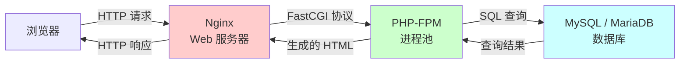

+++
title = "第42章：LAMP/LEMP 环境搭建"
weight = 420
date = "2026-03-24T13:18:28+08:00"
type = "docs"
description = ""
isCJKLanguage = true
draft = false
+++


# 第四十二章：LAMP/LEMP 环境搭建

LAMP和LEMP是搭建动态网站或Web应用的经典架构。L代表Linux操作系统，A/N是Apache/Nginx这两位"看门大爷"，M是MySQL/MariaDB数据库（数据仓库管理员），P是PHP/Python/Perl脚本语言（负责动态生成网页）。

> 本章配套视频：从零开始，30分钟搭好一个能跑WordPress的环境。

## 42.1 LAMP 环境

### 42.1.1 Linux + Apache + MySQL + PHP

LAMP 是经典的 Web 应用架构，四个组件各司其职——Apache 负责收发 HTTP 请求，PHP 负责执行代码生成页面，MySQL / MariaDB 负责存数据。


```mermaid
graph LR
    A["浏览器"] -->|"HTTP 请求"| B["Apache<br/>Web 服务器"]
    B -->|"交给 PHP 模块执行"| C["PHP<br/>脚本解释器"]
    C -->|"SQL 查询"| D["MySQL / MariaDB<br/>数据库"]
    D -->|"查询结果"| C
    C -->|"生成的 HTML"| B
    B -->|"HTTP 响应"| A
    style B fill:#ffcccc
    style C fill:#ccffcc
    style D fill:#ccffff
```

在 LAMP 里，PHP 是以 **Apache 模块**（`libapache2-mod-php`，也就是常说的 mod_php）的形式嵌在 Apache 进程里的，所以不需要额外的 PHP 进程。

**安装 LAMP**（Ubuntu / Debian）：

```bash
sudo apt update
sudo apt install apache2 mariadb-server \
    php libapache2-mod-php php-mysql \
    php-curl php-gd php-mbstring php-xml php-zip php-intl php-soap
```

> 原稿的安装命令里有一项 `php-xmlrpc`——**这个包对 PHP 8 已经不存在了**（XML-RPC 扩展在 PHP 8.0 被移除，移到了 PECL）。照抄那行命令，apt 会直接报"无法定位软件包"。

```bash
# 依次确认三个组件都装好了
php -v
mysql --version
apache2 -v
```

```text
PHP 8.3.6 (cli) (built: Apr 15 2024 00:00:00) (NTS)
Copyright (c) The PHP Group
Zend Engine v4.3.6, Copyright (c) Zend Technologies

mysql  Ver 15.1 Distrib 10.11.6-MariaDB, for debian-linux-gnu (x86_64)

Server version: Apache/2.4.58 (Ubuntu)
```

> 上面的版本号只是示例，实际取决于你的发行版。有个容易误解的点：`php -v` 看到的是**命令行版本**（cli），和 Apache 里跑的 PHP 用的是两套配置。`php -v` 正常，不代表网页里的 PHP 也正常。

```bash
# 用一张测试页确认 Apache 与 PHP 确实打通了
echo '<?php phpinfo(); ?>' | sudo tee /var/www/html/info.php > /dev/null

# 浏览器访问 http://你的服务器IP/info.php，看到 PHP 信息页就说明成功
```

> **看完记得删掉。** `info.php` 会把 PHP 版本、编译参数、已装扩展甚至环境变量全部公开，是攻击者最想要的东西之一：
>
> ```bash
> sudo rm /var/www/html/info.php
> ```

## 42.2 LEMP 环境

### 42.2.1 Linux + Nginx + MySQL + PHP-FPM

LEMP 把 Apache 换成 Nginx，PHP 不再嵌在 Web 服务器里，而是由独立的 **PHP-FPM**（FastCGI Process Manager）进程池执行，两者之间用 FastCGI 协议通信。


```mermaid
graph LR
    A["浏览器"] -->|"HTTP 请求"| B["Nginx<br/>Web 服务器"]
    B -->|"FastCGI 协议"| C["PHP-FPM<br/>进程池"]
    C -->|"SQL 查询"| D["MySQL / MariaDB<br/>数据库"]
    D -->|"查询结果"| C
    C -->|"生成的 HTML"| B
    B -->|"HTTP 响应"| A
    style B fill:#ffcccc
    style C fill:#ccffcc
    style D fill:#ccffff
```

**安装 LEMP**（Ubuntu / Debian）：

```bash
sudo apt update

# Web 服务器
sudo apt install nginx

# 数据库
sudo apt install mariadb-server

# PHP 与 FPM
sudo apt install php-fpm php-mysql \
    php-curl php-gd php-mbstring php-xml php-zip php-intl php-soap

# 确认版本
php -v
nginx -v
```

```text
PHP 8.3.6 (fpm-fcgi) (built: Apr 15 2024 00:00:00)
Copyright (c) The PHP Group
Zend Engine v4.3.6, Copyright (c) Zend Technologies
```

> `php-fpm -v` 这个命令在很多发行版上**并不存在**：可执行文件叫 `php-fpm8.3` 之类，而且通常不在普通用户的 `PATH` 里。想看 FPM 的版本，直接用 `php -v`（注意括号里是不是 `fpm-fcgi`），或者 `systemctl status php8.3-fpm`。
>
> 另外，搭 LEMP 时**不要**再装 `libapache2-mod-php`：那会把 Apache 一并拖进来，还容易让人搞不清网页里的 PHP 到底由谁执行。

## 42.3 PHP-FPM 配置

### 42.3.1 安装与查看状态

PHP-FPM 是 PHP 的 FastCGI 进程管理器：它常驻后台维护一组 PHP 工作进程，Nginx 把请求交给它执行。

```bash
# 安装（通常随 php 包一起装好，这里再确认一次）
sudo apt install php-fpm

# 先看装的是哪个版本，后面的服务名、路径都按它来写
ls /etc/php/
```

```text
8.3
```

```bash
# 查看服务状态（服务名带版本号）
sudo systemctl status php8.3-fpm
```

```text
php8.3-fpm.service - The PHP 8.3 FastCGI Process Manager
     Loaded: loaded (/lib/systemd/system/php8.3-fpm.service; enabled)
     Active: active (running) since Mon 2026-03-23 10:00:00 CST; 1min 30s ago
```

### 42.3.2 socket 配置

Nginx 和 PHP-FPM 之间可以走 Unix Socket，也可以走 TCP 端口。先看当前用的是哪种：

```bash
# 把 8.3 换成你自己的版本
grep -E '^listen' /etc/php/8.3/fpm/pool.d/www.conf
```

```text
listen = /run/php/php8.3-fpm.sock
```

```bash
# 确认 socket 文件真的存在
ls -l /run/php/
```

在 Nginx 站点配置里指向它：

```nginx
server {
    listen 80;
    server_name _;
    root /var/www/html;
    index index.php index.html;

    location ~ \.php$ {
        include snippets/fastcgi-php.conf;
        fastcgi_pass unix:/run/php/php8.3-fpm.sock;
    }
}
```

> Debian / Ubuntu 提供的 `snippets/fastcgi-php.conf` 已经替你做完了关键的两件事：`try_files $uri =404;`（防止把不存在的路径拼进 `SCRIPT_FILENAME`，那会导致任意文件被执行）以及 `include fastcgi_params;` 加 `SCRIPT_FILENAME` 的设置。
>
> 所以**不要**再重复写 `include fastcgi_params;` 和 `fastcgi_param SCRIPT_FILENAME ...;`——重复写虽然不报错，但属于典型的复制粘贴痕迹，而且以后改错一处很难发现。原稿的示例里就有这个重复。

想改成走 TCP 端口：

```ini
; /etc/php/8.3/fpm/pool.d/www.conf
listen = 127.0.0.1:9000
```

```nginx
# Nginx 配置中相应改成
fastcgi_pass 127.0.0.1:9000;
```

> **Socket 和 TCP 怎么选？**
>
> - **Unix Socket**：不经过 TCP 协议栈，没有网络开销，也天然无法从外部访问。**Nginx 和 PHP-FPM 同机部署时首选**
> - **TCP 端口**：可以跨主机（Web 和 PHP 分在两台机器上），部署更灵活；代价是多一层协议开销，而且必须只监听 `127.0.0.1` 或内网地址，绝不能裸暴露到公网
>
> 如果 Nginx 返回 **502 Bad Gateway**，优先查两件事：Nginx 错误日志里有没有 `connect() to unix:... failed (13: Permission denied)`（socket 属主 / 属组与 Nginx 运行用户不匹配），以及 `fastcgi_pass` 里的路径是不是写错了 PHP 版本号。

## 42.4 MySQL/MariaDB 安装与配置

### 42.4.1 apt install mariadb-server

MariaDB是MySQL的社区 fork，兼容MySQL API且完全开源。

```bash
# 安装MariaDB
sudo apt install mariadb-server

# 启动并设置开机自启
sudo systemctl start mariadb
sudo systemctl enable mariadb

# 安全初始化（设置root密码等）
sudo mysql_secure_installation
```

```bash
# 安全初始化交互过程
NOTE: RUNNING ALL PARTS OF THIS SCRIPT IS RECOMMENDED FOR ALL MariaDB
      SERVERS IN PRODUCTION USE!  PLEASE READ EACH STEP CAREFULLY!

In order to log into MariaDB to secure it, we'll need the current
password of the root user.  If you've just installed MariaDB, and
you haven't set the root password yet, the password will be blank,
so you should just press enter here.

Enter current password for root (enter for none): 
OK, successfully used password, moving on...

Set root password? [Y/n] Y
New password: 
Re-enter new password: 
Password updated successfully!

Remove anonymous users? [Y/n] Y
 ... Success!

Disallow root login remotely? [Y/n] Y
 ... Success!

Remove test database and access to it? [Y/n] Y
 - Dropping test database...
 ... Success!
 - Removing privileges on test database...
 ... Success!
Reloading the privilege tables will ensure that all changes
made so far will take effect immediately.
 ... Success!
```

**基本数据库操作**：

```bash
# 登录（Debian / Ubuntu 上 root 默认走 unix_socket 认证，所以 sudo 进来不用密码）
sudo mysql
```

```sql
-- 创建数据库（utf8mb4 才能完整支持 emoji 和生僻字）
CREATE DATABASE myapp CHARACTER SET utf8mb4 COLLATE utf8mb4_unicode_ci;

-- 给应用创建专用账号，只授权这一个库
CREATE USER 'appuser'@'localhost' IDENTIFIED BY 'StrongPassword123!';
GRANT ALL PRIVILEGES ON myapp.* TO 'appuser'@'localhost';

-- 查看结果
SHOW DATABASES;
SELECT user, host FROM mysql.user;

-- 退出
EXIT;
```

> **`FLUSH PRIVILEGES;` 这一句不需要写。** `CREATE USER`、`GRANT` 这类语句会自动更新权限表；"改完必须 FLUSH" 是直接改 `mysql.user` 表那种老做法才需要的。网上到处都在抄这一行，其实纯属多余。
>
> 另外，给应用建账号时**不要图省事直接让应用用 root 连数据库**。单独建账号、只授予它需要的那一个库，应用万一被攻破，能造成的破坏范围也被限制住了。密码别硬编码在代码里，放环境变量或配置文件，并确保配置文件不会被下载。

## 42.5 php.ini 配置

PHP 的主配置文件是 `php.ini`。先记住一个关键点：**CLI 和 FPM 用的是两份不同的 php.ini。**

```bash
# 命令行 PHP 用的是哪份
php --ini
```

```text
Loaded Configuration File:         /etc/php/8.3/cli/php.ini
```

而在网页里（FPM）生效的是另一份：

```bash
ls -l /etc/php/8.3/fpm/php.ini
```

> 这正是"明明改了 php.ini 却不生效"的头号原因——改的是 `cli` 那份，而网页跑的是 `fpm` 那份。（LAMP 环境还要注意 `/etc/php/8.3/apache2/php.ini`。）改完记得重启对应的服务：FPM 是 `sudo systemctl restart php8.3-fpm`。

### 42.5.1 时区设置

```ini
; /etc/php/8.3/fpm/php.ini
date.timezone = Asia/Shanghai
```

不设时区时 PHP 默认按 UTC 走，日志时间和 `date()` 的输出都会差 8 小时，排查问题时很容易看错时间线。

### 42.5.2 错误显示

```ini
; 生产环境：错误不暴露给用户，但一定要记进日志
display_errors = Off
log_errors = On
error_log = /var/log/php/error.log

; 开发环境：把错误显示出来方便调试
; display_errors = On
; error_reporting = E_ALL
```

> 生产环境开着 `display_errors` 是很常见的低级事故：报错信息里经常包含文件的绝对路径、SQL 语句片段，甚至数据库账号。要让错误信息可见，去看错误日志。
>
> 还要注意 `error_log` 指向的目录必须存在、且对 PHP 运行用户（FPM 是 `www-data`）可写，否则 PHP 会静默地写不进去：
>
> ```bash
> sudo mkdir -p /var/log/php && sudo chown www-data:adm /var/log/php
> ```

### 42.5.3 文件上传

```ini
file_uploads = On
upload_max_filesize = 20M     ; 单个文件上限
post_max_size = 25M           ; 整个请求体的上限，必须大于 upload_max_filesize
max_file_uploads = 20         ; 一次请求最多上传几个文件
```

> 最容易踩的坑是：**`post_max_size` 一定要比 `upload_max_filesize` 大**。如果两者相等（或后者更大），一个刚好顶到上限的文件再加上表单里的其它字段就会超出整个请求体的限制，表现为"上传失败却没有任何提示"。
>
> 上传大文件时还要顺带检查 Nginx 的 `client_max_body_size`——它默认只有 **1MB**，超过会直接返回 413，很多人第一次做图片上传就是栽在这里。

## 42.6 虚拟主机配置示例

**Nginx 虚拟主机（LEMP）**：

```nginx
# /etc/nginx/sites-available/myapp.conf
server {
    listen 80;
    server_name myapp.example.com;

    # 注意 root 指向 public/，不是项目根目录
    root /var/www/myapp/public;
    index index.php index.html;

    access_log /var/log/nginx/myapp.access.log;
    error_log /var/log/nginx/myapp.error.log;

    location / {
        # 先找文件、再找目录，都没有就交给入口文件（框架路由）
        try_files $uri $uri/ /index.php?$query_string;
    }

    location ~ \.php$ {
        include snippets/fastcgi-php.conf;    # 已含 try_files 与 fastcgi_params
        fastcgi_pass unix:/run/php/php8.3-fpm.sock;
    }

    # 禁止访问隐藏文件，但放行 .well-known（证书验证要用）
    location ~ /\.(?!well-known).* {
        deny all;
    }
}
```

> 这是现代 PHP 框架（Laravel、Symfony 等）的通行写法，核心思想是**把 Web 根目录限制在 `public/`**，而不是项目根目录。否则 `.env`（里面往往就有数据库密码和应用密钥）、`composer.json`、`.git` 都可能被直接下载走。

**Apache 虚拟主机（LAMP）**：

```apache
# /etc/apache2/sites-available/myapp.conf
<VirtualHost *:80>
    ServerName myapp.example.com
    DocumentRoot /var/www/myapp/public

    <Directory /var/www/myapp/public>
        Options -Indexes +FollowSymLinks
        AllowOverride All
        Require all granted
    </Directory>

    ErrorLog ${APACHE_LOG_DIR}/myapp.error.log
    CustomLog ${APACHE_LOG_DIR}/myapp.access.log combined
</VirtualHost>
```

启用站点：

```bash
# Nginx
sudo ln -s /etc/nginx/sites-available/myapp.conf /etc/nginx/sites-enabled/
sudo nginx -t && sudo systemctl reload nginx

# Apache
sudo a2ensite myapp
sudo apache2ctl configtest && sudo systemctl reload apache2
```

## 42.7 SSL 证书配置

**Nginx 配置 HTTPS（LEMP）**：

```nginx
# /etc/nginx/sites-available/myapp.conf
# 80 端口只负责跳到 HTTPS
server {
    listen 80;
    server_name myapp.example.com;
    return 301 https://$host$request_uri;
}

server {
    listen 443 ssl;
    listen [::]:443 ssl;
    http2 on;                       # Nginx 1.25.1 及以后的写法
    server_name myapp.example.com;

    root /var/www/myapp/public;
    index index.php index.html;

    # Let's Encrypt 证书（fullchain.pem 已含服务器证书 + 中间证书）
    ssl_certificate     /etc/letsencrypt/live/myapp.example.com/fullchain.pem;
    ssl_certificate_key /etc/letsencrypt/live/myapp.example.com/privkey.pem;

    ssl_protocols TLSv1.2 TLSv1.3;
    ssl_ciphers ECDHE-ECDSA-AES128-GCM-SHA256:ECDHE-RSA-AES128-GCM-SHA256;
    ssl_prefer_server_ciphers off;

    # OCSP Stapling：让 Nginx 代客户端去查证书吊销状态
    ssl_stapling on;
    ssl_stapling_verify on;
    ssl_trusted_certificate /etc/letsencrypt/live/myapp.example.com/chain.pem;
    resolver 223.5.5.5 8.8.8.8 valid=300s;

    add_header X-Frame-Options "SAMEORIGIN" always;
    add_header X-Content-Type-Options "nosniff" always;
    add_header Referrer-Policy "strict-origin-when-cross-origin" always;

    location / {
        try_files $uri $uri/ /index.php?$query_string;
    }

    location ~ \.php$ {
        include snippets/fastcgi-php.conf;
        fastcgi_pass unix:/run/php/php8.3-fpm.sock;
    }
}
```

> 说一下 `ssl_trusted_certificate`：它**不是**用来给客户端验证证书链的（客户端要的那条完整链已经由 `fullchain.pem` 提供了），而是给 Nginx 自己用来**验证 OCSP 响应**的。原稿把它注释成"用于完整证书链验证"，是理解错了。如果没开 `ssl_stapling`，这一行可以直接不写。
>
> 另外原稿里的 `add_header X-XSS-Protection "1; mode=block"` 也该删掉——这个头已经废弃，现代浏览器都移除了对应的过滤器，它自身反而会引入问题。

**Apache 配置 HTTPS（LAMP）**：

```apache
# /etc/apache2/sites-available/myapp-ssl.conf
<IfModule mod_ssl.c>
<VirtualHost *:443>
    ServerName myapp.example.com
    DocumentRoot /var/www/myapp/public

    <Directory /var/www/myapp/public>
        Options -Indexes +FollowSymLinks
        AllowOverride All
        Require all granted
    </Directory>

    SSLEngine on
    # fullchain.pem 已经是"服务器证书 + 中间证书"的完整链（Apache 2.4.8+ 支持）
    SSLCertificateFile    /etc/letsencrypt/live/myapp.example.com/fullchain.pem
    SSLCertificateKeyFile /etc/letsencrypt/live/myapp.example.com/privkey.pem

    ErrorLog ${APACHE_LOG_DIR}/myapp-ssl.error.log
    CustomLog ${APACHE_LOG_DIR}/myapp-ssl.access.log combined
</VirtualHost>
</IfModule>
```

> **不要同时写 `SSLCertificateFile` 和 `SSLCertificateChainFile`。** 在 Apache 2.4.6 及更早的版本里，中间证书要用 `SSLCertificateChainFile` 单独指定，所以老教程都是两个都写；从 **2.4.8** 起，把完整链直接放进 `SSLCertificateFile` 成为推荐做法，旧指令已经废弃。两个都写会让中间证书重复出现，部分客户端会报警告。原稿正是把两种年代的写法混在了一起。
>
> Apache 上还要启用模块并启用站点：
>
> ```bash
> sudo a2enmod ssl
> sudo a2ensite myapp-ssl
> sudo apache2ctl configtest && sudo systemctl restart apache2
> ```

**一键申请 Let's Encrypt 证书**：

```bash
# Nginx
sudo certbot --nginx -d myapp.example.com

# Apache
sudo certbot --apache -d myapp.example.com
```

> 两个插件都会自动完成三件事：验证域名归属、把证书路径写进站点配置、装好自动续期（`certbot.timer`）。前提是域名已经解析到本机，且 80 端口能从公网访问。

---

## 本章小结

本章从零把 LAMP 和 LEMP 两套环境搭了起来：

- **LAMP**：Linux + Apache + MariaDB + PHP。PHP 以 Apache 模块（`libapache2-mod-php`）的形式嵌入，不需要额外进程；代价是只能配 prefork MPM
- **LEMP**：Linux + Nginx + MariaDB + PHP-FPM。PHP 由独立的 FPM 进程池执行，Nginx 通过 FastCGI 转发请求，这是目前更主流的组合
- **PHP-FPM**：先 `ls /etc/php/` 确认版本号，再据它填服务名和 socket 路径；同机部署优先用 Unix Socket
- **502 排查**：先看 Nginx 错误日志，多半是 socket 权限或路径写错版本号
- **数据库**：安装后用 `mysql_secure_installation` 做基本加固；给应用建专用账号、只授权需要的库；`GRANT` 之后**不需要** `FLUSH PRIVILEGES`
- **php.ini**：CLI 与 FPM 是两份文件，改错地方是"配置不生效"的头号原因；生产环境必须关掉 `display_errors`
- **虚拟主机**：`root` 指向 `public/` 而不是项目根目录，把 `.env`、`.git` 挡在 Web 之外
- **HTTPS**：用 `certbot --nginx` / `--apache` 自动申请并配置；`fullchain.pem` 已含中间证书，不必再单独指定链文件

环境跑起来只是起点。接下来还要把 PHP 的错误显示、上传限制、Nginx 的请求体大小这些细节调好，才算是一个能上线的站点。下一章我们进入数据库。
