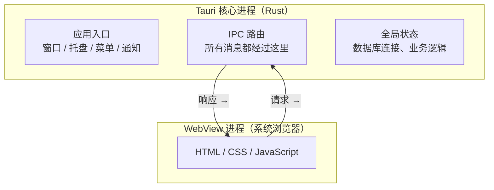

+++
title = "4.1 进程模型与系统 WebView"
date = 2026-09-09T17:00:00+08:00
weight = 41
type = "docs"
description = ""
isCJKLanguage = true
draft = false
+++

> 原文链接: [Process Model](https://tauri.app/concept/process-model/)

# 4.1 进程模型与系统 WebView

这是 Tauri 最值得先搞懂的一节。搞懂它，你就明白“为什么前端不能直接碰系统文件”“为什么 WebView 崩溃不会带走整个应用”“为什么要设权限”。

## 一个应用里有两个世界

图中清楚地分成两层：

- **核心进程（Core Process）**：一个 Rust 程序，也是整个应用唯一能“直接碰操作系统”的部分。
- **WebView 进程**：负责渲染你的界面，运行前端代码。

## 为什么要分这么多进程？

早期 GUI 程序常把“算数据”和“画界面”放在同一个进程。一旦某个计算很慢，窗口就会卡死；一旦某段代码崩溃，整个应用一起消失。

把界面和逻辑拆开以后：

1. 网页崩溃了，Rust 核心进程还活着；
2. 复杂计算用 async Rust 命令放到异步运行时执行，避免长时间占用核心进程主线程；
3. 攻击者即使攻破 WebView，也无法通过正常的 IPC API 直接获得系统权限。

这种思路对应一个经典安全原则：**最小权限原则（Principle of Least Privilege）**。就像你请园丁修剪花园，只需给他花园钥匙，不必把家门钥匙也给他。

## 系统 WebView 是“租来的浏览器”

Tauri 不打包自己的浏览器引擎，而是在每个平台借用系统 WebView：

| 平台 | Tauri 使用的引擎 |
| --- | --- |
| Windows | Microsoft Edge WebView2（基于 Chromium） |
| macOS | WKWebView |
| Linux | WebKitGTK |
| iOS | WKWebView |
| Android | Android WebView |

好处是安装包极小；代价是行为会随系统 WebView 的版本变化。这也是为什么 Tauri 官方建议你做**跨平台兼容性测试**。

## 核心进程才是“管家”

你可以把核心进程想象成一位管家：

- 它创建并管理窗口、托盘、菜单；
- 它集中处理所有 IPC 消息，可以在中途拦截、过滤、丢弃；
- 它保管敏感全局状态（数据库连接、密钥、业务逻辑）；
- 它对操作系统拥有完整权限。

所以 Rust 代码里不应该随意信任前端传来的参数，而前端也不该保存密钥等敏感信息。

## Rust 为什么适合当管家

Rust 通过所有权与借用系统在编译期阻止很多内存错误，同时没有垃圾回收带来的停顿。对“要长期持有系统权限的进程”来说，这是很合适的安全底座。

## 小结

- Tauri = 1 个 Rust 核心进程 + N 个系统 WebView 进程。
- IPC 是两者之间唯一正式通道。
- 系统能力集中在核心进程，因此前端攻击面被显著缩小。

下一步学习 IPC 的两大主角：**Commands（命令）**与 **Events（事件）**，见 [4.2 命令、事件与数据流动](../4.2-ipc-commands-and-events/)。
