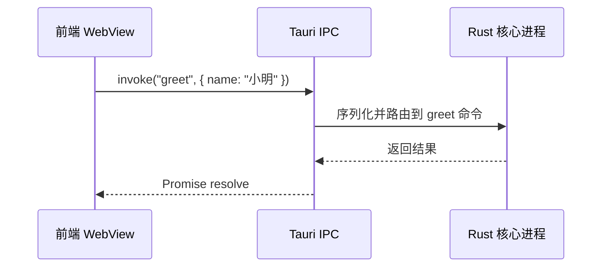
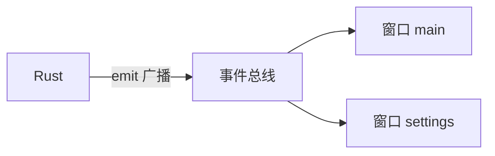

+++
title = "4.2 IPC：命令、事件与数据流动"
date = 2026-09-09T17:00:00+08:00
weight = 42
type = "docs"
description = ""
isCJKLanguage = true
draft = false
+++


> 原文链接: [Inter-Process Communication](https://tauri.app/concept/inter-process-communication/) 与 [Calling Rust from the Frontend](https://tauri.app/develop/calling-rust/)

# 4.2 IPC：命令、事件与数据流动

IPC 是 Tauri 的生命线。前端和 Rust 进程之间不能直接共享内存或直接调用函数，而是通过 **异步消息传递** 通信。



消息传递比直接共享内存更安全，因为接收方可以拒绝请求。例如 Rust 端发现某个调用没有通过权限检查，可以直接丢弃。

## Commands：前端“打电话”给 Rust

Commands 是“一问一答”型 IPC，适合获取数据、执行计算。它类似浏览器里的 `fetch`，但目的地是你的 Rust 函数。

### 第一步：在 Rust 定义命令

```rust
#[tauri::command]
fn greet(name: &str) -> String {
    // 拼接问候语并返回给前端
    format!("你好，{}！", name)
}
```

### 第二步：注册命令

在 `lib.rs` 的 Builder 中加入 `.invoke_handler(tauri::generate_handler![...])`：

```rust
#[cfg_attr(mobile, tauri::mobile_entry_point)]
pub fn run() {
    tauri::Builder::default()
        .invoke_handler(tauri::generate_handler![greet])
        .run(tauri::generate_context!())
        .expect("运行 Tauri 应用时出错");
}
```

### 第三步：前端调用

安装官方 API：

```sh
npm install @tauri-apps/api
```

然后调用：

```ts
import { invoke } from '@tauri-apps/api/core';

const message = await invoke<string>('greet', { name: '小明' });
console.log(message);
```

### 命令变多时：拆到独立文件

所有命令都写在 `lib.rs` 会让文件迅速膨胀。可以拆到 `src-tauri/src/commands.rs`：

```rust
// src-tauri/src/commands.rs

#[tauri::command]
pub fn greet(name: &str) -> String {
    format!("你好，{}！", name)
}
```

然后在 `lib.rs` 中声明模块并注册：

```rust
mod commands;

#[cfg_attr(mobile, tauri::mobile_entry_point)]
pub fn run() {
    tauri::Builder::default()
        .invoke_handler(tauri::generate_handler![commands::greet])
        .run(tauri::generate_context!())
        .expect("运行 Tauri 应用时出错");
}
```

注意一个容易踩的坑：

- 命令直接写在 `lib.rs` 时，**不要**标 `pub`；
- 命令拆到独立模块后，**必须**标 `pub`，并在 `generate_handler!` 中写完整路径 `commands::greet`。

无论放哪里，命令名都只取函数名本身（例如 `greet`），前端调用时不需要写 `commands::` 前缀。

## 参数命名：camelCase

JavaScript 对象默认使用 **camelCase**，Rust 函数参数使用 **snake_case**，Tauri 会自动映射：

```rust
#[tauri::command]
fn save_note(note_id: u32, content: String) {
    // 参数在 JSON 中是 noteId 与 content
    println!("保存 {} 号笔记：{}", note_id, content);
}
```

前端：

```js
invoke('save_note', { noteId: 7, content: '买牛奶' });
```

如果想强制前端也使用 snake_case，可以给命令加属性：

```rust
#[tauri::command(rename_all = "snake_case")]
fn save_note(note_id: u32, content: String) {}
```

## 返回值与错误处理

返回值可以是任何能序列化为 JSON 的类型。需要表达失败时，返回 `Result`：

```rust
#[tauri::command]
fn login(user: String, password: String) -> Result<String, String> {
    if user == "admin" && password == "123456" {
        // 验证成功
        Ok("logged_in".into())
    } else {
        // 验证失败
        Err("用户名或密码错误".into())
    }
}
```

前端：

```ts
invoke('login', { user, password })
  .then((session) => console.log(session))
  .catch((error) => console.error(error));
```

> 经验：不要把标准库错误类型直接返回给前端，因为很多错误类型没有实现 `serde::Serialize`。简单场景先 `map_err(|e| e.to_string())`，复杂场景自定义一个可序列化的错误枚举。

## async 命令

普通（非 `async`）命令默认在 Tauri 核心进程的**主线程**上执行。如果同步命令里写很重的计算或 `sleep`，窗口管理、IPC 等仍可能被拖慢。

耗时操作应声明为 `async`，让 Tauri 把它调度到异步运行时：

```rust
#[tauri::command]
async fn do_heavy_work() -> String {
    some_async_function().await;
    "完成".into()
}
```

`async` 命令在 Tauri 的异步运行时里执行。注意：异步命令参数中尽量避免借用类型（如 `&str`、`State<'_, T>`），可改用 `String` 或让返回类型包含 `Result`。

如果你的函数因历史原因不能写成 `async fn`，也可以使用 `#[tauri::command(async)]` 属性，让同步函数体在异步任务中执行。

## Events：更像“群发广播”

Events 是**单向、即发即忘**的消息，适合通知状态变化，例如“下载完成”“登录成功”。



### Rust 发送全局事件

```rust
use tauri::{AppHandle, Emitter};

#[tauri::command]
fn download_finished(app: AppHandle, file_name: String) {
    // 向所有监听者广播
    app.emit("download-finished", &file_name).unwrap();
}
```

前端也可以发出事件，其他窗口与 Rust 监听者都能收到：

```ts
import { emit } from '@tauri-apps/api/event';

// 例如通知其他窗口主题已切换
await emit('theme-changed', 'dark');
```

只想发给某个具体窗口时，可使用 `emitTo`：

```ts
import { emitTo } from '@tauri-apps/api/event';

// 只通知 label 为 "settings" 的窗口
await emitTo('settings', 'settings-update-requested', { key: 'theme', value: 'dark' });
```

### 只发给特定窗口

```rust
use tauri::{AppHandle, Emitter};

#[tauri::command]
fn notify_login(app: AppHandle) {
    // 只发给 label 为 "login" 的窗口
    app.emit_to("login", "login-result", "success").unwrap();
}
```

### 前端监听事件

```ts
import { listen } from '@tauri-apps/api/event';

// listen 返回 Promise，解析后才是取消监听的函数
const unlisten = await listen<string>('download-finished', (event) => {
  console.log('下载完成：', event.payload);
});

// 组件卸载等时机记得取消，避免内存泄漏
unlisten();
```

在 React 里，通常放在 `useEffect` 的清理函数中：

```tsx
useEffect(() => {
  // listen 返回 Promise，resolve 后才是真正的取消函数
  const unlisten = listen<string>('download-finished', (event) => {
    console.log('下载完成：', event.payload);
  });

  // 组件卸载时取消监听，即使 Promise 稍后才完成也会被清理
  return () => {
    unlisten.then((fn) => fn());
  };
}, []);
```

## Commands 与 Events 怎么选

| 需求 | 选什么 |
| --- | --- |
| 前端取数据、要返回值 | Command |
| 前端触发一次动作并关注结果 | Command |
| Rust 主动通知前端 | Event |
| 一个事件被多个窗口监听 | Event |
| 高频、有序、大量数据流 | Channel（见 [4.3 状态管理、事件进阶与 Channels](../4.3-events-channels-and-state/)） |

## 需要权限吗？

- 你**自己注册的自定义命令**默认允许所有窗口调用；
- 官方核心 API 与插件命令默认被限制，需要在 capabilities 中放行；

完整规则见 [4.5 权限系统与安全边界](../4.5-permissions-capabilities-and-security/)。

## 官方参考

- [Calling Rust from the Frontend](https://tauri.app/develop/calling-rust/)
- [Calling the Frontend from Rust](https://tauri.app/develop/calling-frontend/)
