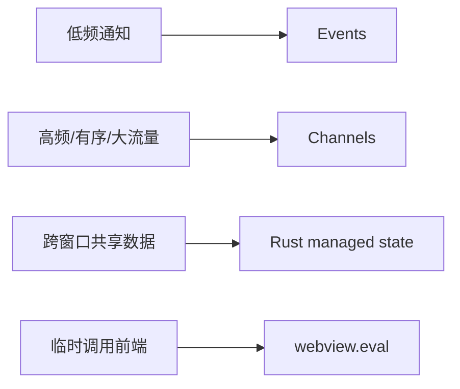

+++
title = "4.3 事件进阶、Channels 与状态管理"
date = 2026-09-09T17:00:00+08:00
weight = 43
type = "docs"
description = ""
isCJKLanguage = true
draft = false
+++


> 原文链接: [Calling the Frontend from Rust](https://tauri.app/develop/calling-frontend/) 与 [State Management](https://tauri.app/develop/state-management/)

# 4.3 事件进阶、Channels 与状态管理

这一节把“后端如何推数据给前端”和“Rust 如何保存跨窗口状态”讲透。

## 事件不止一种

Tauri 事件分两级：

| 类型 | API | 说明 |
| --- | --- | --- |
| 全局事件 | `app.emit(...)` | 所有监听者都能收到 |
| 窗口事件 | `app.emit_to(label, ...)` | 只有指定 WebviewWindow 能收到 |

Rust 端既能发送，也能监听：

```rust
use tauri::Listener;

#[cfg_attr(mobile, tauri::mobile_entry_point)]
pub fn run() {
    tauri::Builder::default()
        .setup(|app| {
            // 在 Rust 端监听全局事件
            app.listen("app-ready", |event| {
                println!("收到事件：{}", event.payload());
            });
            Ok(())
        })
        .run(tauri::generate_context!())
        .expect("运行 Tauri 应用时出错");
}
```

只监听一次，用 `once`；Rust 监听函数返回的事件 id 也可用于 `unlisten(event_id)`。

## 什么时候别用事件

官方文档明确指出：事件系统适合低频、小数据、多消费者场景；它**不适合低延迟或高吞吐的连续数据流**。事件 payload 最终会被序列化为 JSON 字符串，太大时会浪费内存与 CPU。

如果你需要：

- 稳定的顺序；
- 高频数据；
- 大块二进制数据流；

请使用 **Channels（通道）**。

## Channels 示例

Channels 很像一条“专用水管”：Rust 一端往里放数据，前端通过回调持续接收。

Rust 端：

```rust
use tauri::ipc::Channel;

#[tauri::command]
async fn stream_numbers(on_event: Channel<u32>) {
    for i in 1..=5u32 {
        // 前端 onEvent 会被调用 5 次
        on_event.send(i).unwrap();
    }
}
```

前端：

```ts
import { invoke, Channel } from '@tauri-apps/api/core';

const onEvent = new Channel<number>();

// 通道收到 Rust 数据时执行
onEvent.onmessage = (message) => {
  console.log('收到 Rust 数据：', message);
};

await invoke('stream_numbers', { onEvent });
```

官方还常把 Channels 用于下载进度、子进程输出、WebSocket 消息等场景。

## Rust 直接执行前端 JS

若只是临时触发前端逻辑，也可以让 Rust 直接调用 WebView 的 `eval`：

```rust
use tauri::Manager;

#[tauri::command]
fn flash_title(webview: tauri::WebviewWindow) {
    // 让前端弹一条提示
    webview.eval("window.alert('来自 Rust 的问候')").unwrap();
}
```

但“发事件”比“拼 JS 字符串”更安全、更好维护，应优先使用事件/通道。

## 状态管理：把数据放进 Rust

想让多个窗口共享同一个数据库连接、配置对象或计数器，不要在 JS 里各存一份，而应使用 Tauri 的 **managed state**。

### 定义并注册状态

```rust
struct Counter {
    value: std::sync::Mutex<u32>,
}

#[cfg_attr(mobile, tauri::mobile_entry_point)]
pub fn run() {
    tauri::Builder::default()
        .manage(Counter {
            value: std::sync::Mutex::new(0),
        })
        .run(tauri::generate_context!())
        .expect("运行 Tauri 应用时出错");
}
```

### 在命令中访问

```rust
#[tauri::command]
fn increment(counter: tauri::State<Counter>) -> u32 {
    let mut value = counter.value.lock().unwrap();
    *value += 1;
    *value
}
```

`State<'_, Counter>` 会由 Tauri 注入，不需要你手动传参。

> 提醒：跨线程共享数据时，尽量使用 `Mutex`/`RwLock`，并保证 Rust 端锁不跨 `await`，避免死锁。

## 小结



按场景选工具，比“哪种 API 更高级”更重要。

## 下一步

消息系统有了，接下来认识承载它们的配置文件： [4.4 配置文件详解](../4.4-configuration-files/)。
