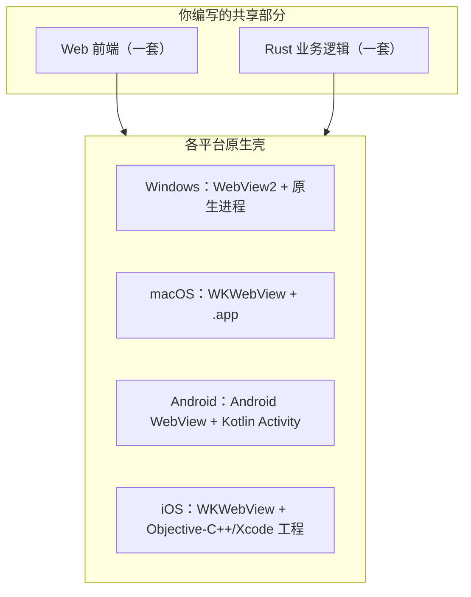

+++
title = "5.1 跨平台开发总览"
date = 2026-09-09T17:00:00+08:00
weight = 51
type = "docs"
description = ""
isCJKLanguage = true
draft = false
+++


> 原文链接: [Develop](https://tauri.app/develop/)

# 5.1 跨平台开发总览

到了这一章，我们要回答你最关心的问题：**同一套代码在 macOS、Windows、Android、iOS 上分别是什么样子？**

## 先记住一个模型



Tauri 的策略是：**Web 前端和 Rust 逻辑尽量共享，只让“壳工程”跟随平台变化**。所谓壳工程，就是系统用来启动和托管你的应用的少量原生代码。

## 平台差异总表

| 平台 | 渲染引擎 | 原生工具 | 生成工程位置 | 常见最终产物 |
| --- | --- | --- | --- | --- |
| Windows | WebView2 | Visual Studio C++ Build Tools | 不需要额外生成 | `.exe`、`.msi` |
| macOS | WKWebView | Xcode Command Line Tools / Xcode | 不需要额外生成 | `.app`、`.dmg` |
| Linux | WebKitGTK | 各发行版依赖 | 不需要额外生成 | `.deb`、`.rpm`、AppImage |
| Android | Android WebView | Android Studio | `src-tauri/gen/android/` | `.apk`、`.aab` |
| iOS | WKWebView | Xcode + CocoaPods | `src-tauri/gen/apple/` | `.app`、`.ipa` |

注意：桌面平台由 Rust 编译出一个**可执行文件**，移动平台则是把 Rust 编译成**静态库/动态库**，再被原生壳加载。

## 开发命令对照

| 场景 | 命令 |
| --- | --- |
| 桌面开发 | `npm run tauri dev` |
| 桌面发布构建 | `npm run tauri build` |
| Android 开发 | `npm run tauri android dev` |
| iOS 开发 | `npm run tauri ios dev` |
| Android 发布构建 | `npm run tauri android build` |
| iOS 发布构建 | `npm run tauri ios build` |

## 为什么会有 gen/ 目录？

初次创建项目时，你看到的只有 `src-tauri/`。执行移动端初始化后，会生成平台原生产物：

```text
src-tauri/
├── tauri.conf.json
├── src/
├── gen/
│   ├── android/          # 由 tauri android init 生成
│   │   ├── settings.gradle
│   │   ├── app/
│   │   └── gradlew
│   └── apple/            # 由 tauri ios init 生成
│       ├── Podfile
│       ├── Assets.xcassets
│       ├── Sources/
│       └── YourApp.xcodeproj
└── schemas/              # IDE 自动补全用的 schema
```

桌面平台不生成类似壳工程，是因为操作系统直接运行编译好的二进制即可。

## 三个重要的平台现实

1. **iOS 只能在 macOS 上构建**，苹果有明确限制。
2. **Android 构建主要靠 Gradle**，因此路径里有大量 `.gradle` 文件。
3. **Windows 构建最好在 Windows 上做**；虽可用 CI 或 `cargo-xwin` 交叉编译，但原生 WebView2/安装包工具仍以 Windows 环境最省心。

## 平台专属配置

平台差异还能通过 `tauri.macos.conf.json`、`tauri.windows.conf.json`、`tauri.android.conf.json`、`tauri.ios.conf.json` 微调，见 [4.4 配置文件详解](../../core-concepts/4.4-configuration-files/)。

## 下一步

逐平台看布局与代码：

- [5.2 macOS 应用目录与构建](../5.2-macos-directory-and-build/)
- [5.3 Windows 应用目录与构建](../5.3-windows-directory-and-build/)
- [5.4 Android 工程目录与构建](../5.4-android-directory-and-build/)
- [5.5 iOS 工程目录与构建](../5.5-ios-directory-and-build/)
