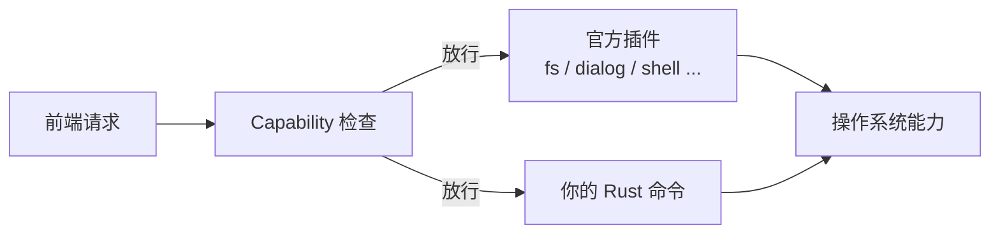

+++
title = "6.1 常用插件与原生能力"
date = 2026-09-09T17:00:00+08:00
weight = 61
type = "docs"
description = ""
isCJKLanguage = true
draft = false
+++


> 原文链接: [Tauri Plugins](https://tauri.app/plugin/)

# 6.1 常用插件与原生能力

Tauri 核心刻意保持“够用就行”，把文件系统、对话框、Shell、通知等常用能力做成插件。这样你需要什么才装什么，攻击面也小。

## 插件的结构

一个插件通常包含：

- **Rust crate**：例如 `tauri-plugin-fs`；
- **JS/TS 包**：例如 `@tauri-apps/plugin-fs`；
- **权限定义**：例如 `fs:default`、`fs:allow-write-text-file`；
- **移动端原生代码**：某些插件还带 Kotlin/Swift 实现。

## 官方常用插件一览

| 能力 | npm 包 | 典型用途 |
| --- | --- | --- |
| 文件系统 | `@tauri-apps/plugin-fs` | 读写文件/目录 |
| 对话框 | `@tauri-apps/plugin-dialog` | 打开/保存文件、消息框 |
| Shell | `@tauri-apps/plugin-shell` | 打开外部程序或链接 |
| 剪贴板 | `@tauri-apps/plugin-clipboard-manager` | 复制/粘贴文本、图片 |
| 通知 | `@tauri-apps/plugin-notification` | 发送系统通知 |
| 全局快捷键 | `@tauri-apps/plugin-global-shortcut` | 注册全局热键 |
| 系统托盘 | 核心 TrayIcon API（`@tauri-apps/api/tray` 或 Rust `TrayIconBuilder`） | 托盘菜单与图标 |
| 数据库 | `@tauri-apps/plugin-sql` | SQLite/MySQL/PostgreSQL |
| 键值存储 | `@tauri-apps/plugin-store` | 保存 JSON 配置 |
| 自动更新 | `@tauri-apps/plugin-updater` | 应用自动更新 |
| HTTP | `@tauri-apps/plugin-http` | 绕过 CORS 的请求 |
| 启动项 | `@tauri-apps/plugin-autostart` | 开机自启 |

## 用 tauri add 安装插件

以文件系统插件为例，命令行：

```sh
npm run tauri add fs
```

大多数官方插件都可以这样自动添加依赖。若 CLI 没有同时安装前端包，再手动执行：

```sh
npm install @tauri-apps/plugin-fs
```

之后还要在 `src-tauri/src/lib.rs` 注册插件：

```rust
#[cfg_attr(mobile, tauri::mobile_entry_point)]
pub fn run() {
    tauri::Builder::default()
        .plugin(tauri_plugin_fs::init())
        .run(tauri::generate_context!())
        .expect("运行 Tauri 应用时出错");
}
```

> 官方插件同时发布 Rust crate 与 npm 包，两者版本通常需要保持一致。例如 `tauri-plugin-fs` 与 `@tauri-apps/plugin-fs` 都应使用同一小版本，避免前端参数和后端命令对不上。

## 第一个文件读写示例

写入：

```ts
import { writeTextFile, BaseDirectory } from '@tauri-apps/plugin-fs';

// 把文本写入应用数据目录下的 notes.txt
await writeTextFile('notes.txt', '你好，Tauri！', {
  baseDir: BaseDirectory.AppData,
});
```

读取：

```ts
import { readTextFile, BaseDirectory } from '@tauri-apps/plugin-fs';

const content = await readTextFile('notes.txt', {
  baseDir: BaseDirectory.AppData,
});
console.log(content);
```

## 别忘了配置权限

插件命令默认被禁用。要让主窗口使用 `fs` 插件，必须在 `src-tauri/capabilities/default.json` 中加入权限。

只读应用目录时，`fs:default` 通常够用：

```json
{
  "$schema": "../gen/schemas/desktop-schema.json",
  "identifier": "default",
  "description": "主窗口能力",
  "windows": ["main"],
  "permissions": [
    "core:default",
    "fs:default"
  ]
}
```

> 注意：`fs:default` 默认只放行读取类命令，不会自动允许写文件。

如果示例要同时读写 `AppData` 下的 `notes.txt`，需要分别放行读/写命令并限定路径：

```json
{
  "$schema": "../gen/schemas/desktop-schema.json",
  "identifier": "default",
  "description": "只允许读写 AppData 下的 notes.txt",
  "windows": ["main"],
  "permissions": [
    "core:default",
    { "identifier": "fs:allow-read-text-file", "allow": [{ "path": "$APPDATA/notes.txt" }] },
    { "identifier": "fs:allow-write-text-file", "allow": [{ "path": "$APPDATA/notes.txt" }] }
  ]
}
```

如果运行时报“目录不存在”之类的错误，先用 Rust/原生代码创建应用目录，或把示例中的 `baseDir` 换成已经存在的目录（如 `BaseDirectory.Home`）。

## 对话框插件

选择文件：

```ts
import { open } from '@tauri-apps/plugin-dialog';

const file = await open({
  multiple: false,
  directory: false,
});

console.log(file);
```

对话框插件同样要放行权限，例如在 capabilities 中加入：

```json
{
  "identifier": "default",
  "windows": ["main"],
  "permissions": ["core:default", "dialog:default"]
}
```

## 什么时候自己写 Rust 命令？

插件覆盖不了、或你想把核心业务逻辑放在 Rust 中时，就自己写命令。复用你已学的内容：

```rust
#[tauri::command]
fn create_session(username: String) -> Result<String, String> {
    if username.is_empty() {
        return Err("用户名为空".into());
    }
    // 真正的会话逻辑...
    Ok(format!("session-{}", username))
}
```

别忘了注册到 `invoke_handler`。

## 原生集成地图



## 下一步

功能做得差不多了，就该考虑打包与分发： [6.2 图标、打包、签名与自动更新](../6.2-icons-bundling-signing-and-updates/)。
