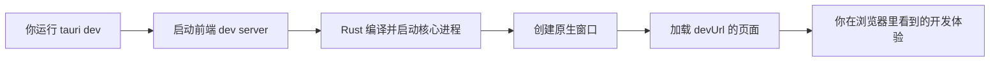

+++
title = "3.3 开发循环与第一个改动"
date = 2026-09-09T17:00:00+08:00
weight = 33
type = "docs"
description = ""
isCJKLanguage = true
draft = false
+++


> 原文链接: [Develop](https://tauri.app/develop/)

# 3.3 开发循环与第一个改动

理解开发循环，能让你从“能打开窗口”进步到“能高效迭代”。

## 开发模式是怎么工作的



`tauri dev` 做的事情可以理解为：

1. 执行配置里的 `beforeDevCommand`（例如 `npm run dev`），启动前端开发服务器；
2. 把 Rust 代码编译为调试版可执行文件；
3. 启动应用，让原生窗口去加载 `devUrl` 指向的页面。

## 最小开发配置

如果你没有使用前端框架，可以让 Tauri 直接提供静态文件服务。在 `src-tauri/tauri.conf.json` 中：

```json
{
  "build": {
    "frontendDist": "../src"
  }
}
```

> 上面只是 `tauri.conf.json` 中与构建有关的片段。要让配置完整可运行，还需要 `productName`、`identifier` 等顶层字段，详见 [4.4 配置文件详解](../../core-concepts/4.4-configuration-files/)。

没有 `devUrl` 时，Tauri 会为 `frontendDist` 指向的目录启动静态文件服务，目录里需要有 `index.html`。如果你用 Vite，则通常写成：

```json
{
  "build": {
    "devUrl": "http://localhost:5173",
    "beforeDevCommand": "npm run dev",
    "frontendDist": "../dist"
  }
}
```

## 常见启动命令

| 包管理器 | 桌面开发 | 桌面发布构建 |
| --- | --- | --- |
| npm | `npm run tauri dev` | `npm run tauri build` |
| pnpm | `pnpm tauri dev` | `pnpm tauri build` |
| yarn | `yarn tauri dev` | `yarn tauri build` |
| bun | `bun tauri dev` | `bun tauri build` |
| cargo | `cargo tauri dev` | `cargo tauri build` |

## 改动前端页面

打开项目根目录的 `index.html`（或 Vue/React 的页面组件），把标题改成你自己的内容：

```html
<!doctype html>
<html lang="zh-CN">
  <head>
    <meta charset="UTF-8" />
    <meta name="viewport" content="width=device-width, initial-scale=1.0" />
    <title>Tauri Demo</title>
  </head>
  <body>
    <h1>你好，Tauri！</h1>
  </body>
</html>
```

保存后，Tauri 窗口通常会自动刷新，就像在浏览器里做热更新一样。

## 改动 Rust 代码

打开 `src-tauri/src/lib.rs`，加一个“问候”命令：

```rust
#[tauri::command]
fn greet(name: &str) -> String {
    // 把用户的名字带回前端
    format!("你好，{}！", name)
}

#[cfg_attr(mobile, tauri::mobile_entry_point)]
pub fn run() {
    tauri::Builder::default()
        .invoke_handler(tauri::generate_handler![greet])
        .run(tauri::generate_context!())
        .expect("运行 Tauri 应用时出错");
}
```

保存 Rust 文件后，Tauri CLI 会检测到变化并自动重新编译、重启应用。

## 打开 Web Inspector

右键窗口里的页面，选择 **Inspect**，或使用快捷键：

- macOS：`Cmd + Option + I`
- Windows/Linux：`Ctrl + Shift + I`

## 修改 tauri.conf.json 后的重启

注意：**修改 Rust 代码会自动重启；但修改 `tauri.conf.json` 时，最好手动结束并重新运行 `tauri dev`**，因为配置是在编译期读取的。

## 关于 `.taurignore`

如果某些目录被 Rust 编译或前端工具反复修改，导致 Tauri 不停重启，可以在 `src-tauri/` 建 `.taurignore`：

```text
build/
src/generated/*.rs
deny.toml
```

它的语法类似 `.gitignore`。

## 下一步

你已经跑通了基本循环。接下来进入 [第 4 章](../../core-concepts/)，真正理解进程、IPC 与权限系统。
