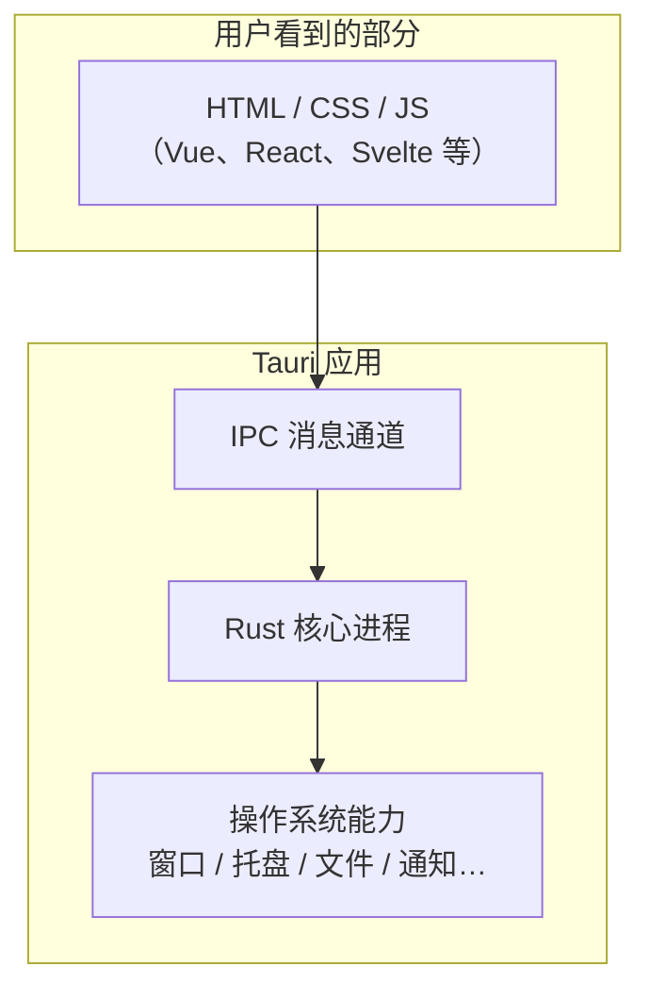

+++
title = "1.1 什么是 Tauri？"
date = 2026-09-09T17:00:00+08:00
weight = 11
type = "docs"
description = ""
isCJKLanguage = true
draft = false
+++

> 原文链接: [What is Tauri?](https://tauri.app/start/)

# 1.1 什么是 Tauri？

简单来说，**Tauri 是一套用来开发“小而快”桌面应用和移动应用的框架**。

你可以继续用自己熟悉的 Web 技术（HTML、CSS、JavaScript，或 Vue、React、Svelte 等前端框架）画界面；当界面需要操作系统能力（读取文件、打开窗口、发送通知等）时，再由后端的 **Rust 程序**去真正执行。Rust 负责“干活”，Web 技术负责“给用户看”。

> 本教程以 **Tauri v2** 为准。Tauri 1.x 的配置格式、命令 API 和插件体系差异很大，网上许多旧教程不能直接照抄。

一个 Tauri 应用大概长这样：

图中的“IPC”是进程间通信（Inter-Process Communication），相当于 Web 页面和 Rust 之间的“邮局”。页面不会直接拿到操作系统权限，而是发消息给 Rust 进程，由 Rust 进程代为执行。这种“先申请、再放行”的设计，是 Tauri 安全模型的根基。

## 为什么叫“Tauri”？

Tauri 这个名字来自一颗恒星名，官方团队想表达“轻巧但持久”的愿景。它由 Tauri 开源社区维护，代码以 MIT 或 Apache-2.0 双许可发布。

## 它能做什么？

Tauri 支持以下目标平台：

| 类别 | 平台 | 界面渲染由谁完成 |
| --- | --- | --- |
| 桌面 | macOS | 系统自带 WKWebView |
| 桌面 | Windows | Microsoft Edge WebView2 |
| 桌面 | Linux | WebKitGTK |
| 移动 | iOS | WKWebView |
| 移动 | Android | Android WebView |

因为它直接使用**操作系统已经内置的浏览器引擎**，所以不需要像 Electron 那样把整个 Chromium 和 Node.js 打进安装包。一个最小 Tauri 应用往往不足 1 MB，这也是它最重要的卖点之一。

## Tauri 的三大优势

官方在 [What is Tauri?](https://tauri.app/start/) 中总结了三句话：

1. **安全的地基**：Tauri 建立在 Rust 之上，默认使用系统 WebView，并通过权限（Capabilities/Permissions）控制前端能调用什么。
2. **更小的体积**：不打包浏览器引擎，包体更小、启动更快。
3. **灵活的技术栈**：前端框架基本不受限制，并且 Rust、Swift、Kotlin 等后端语言也能以插件形式参与。

## 谁在用类似架构？

如果你了解 Electron，可以把 Tauri 理解成“Electron 的轻量级同类”：两者都是“Web 前端 + 本地后端”的桌面应用方案。不同点是 Electron 内置 Chromium 与 Node.js，而 Tauri 使用系统 WebView 与 Rust。关于二者更详细的区别，见 [1.3 Tauri 与 Electron 的对比](../1.3-tauri-vs-electron/)。

## 下一步

先不要纠结全部细节。接下来建议按顺序阅读：

- [1.2 Tauri 的整体架构](../1.2-architecture-overview/)：理解各层组件怎么协作。
- [2.1 在 Apple Silicon Mac 上搭建环境](../../environment-setup/2.1-macos-apple-silicon-prerequisites/)：先让你的 M4 MacBook 能运行 Rust 和 Tauri。
- [3.1 创建第一个 Tauri 应用](../../quick-start/3.1-create-your-first-app/)：做出第一个窗口。
