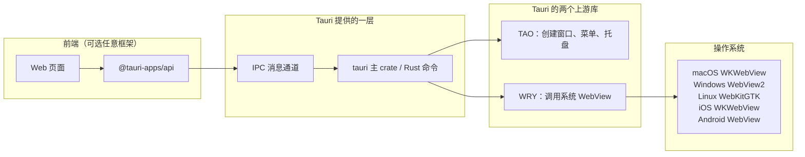

+++
title = "1.2 Tauri 的整体架构"
date = 2026-09-09T17:00:00+08:00
weight = 12
type = "docs"
description = ""
isCJKLanguage = true
draft = false
+++

> 原文链接: [Tauri Architecture](https://tauri.app/concept/architecture/)

# 1.2 Tauri 的整体架构

上一节我们把 Tauri 比作“Web 前端 + Rust 后端”。这一节把中间的黑盒拆开，让你知道每个英文名词到底负责什么。

## 一张图看懂分层

从左到右可以这样理解：

1. **前端页面**负责 UI，通常用 Vite、Next.js、Nuxt 等工具构建成静态资源。
2. **`@tauri-apps/api`** 是官方 JavaScript/TypeScript 库，提供 `invoke()`、`listen()` 等函数。
3. **IPC 通道**把前端的请求送到 Rust。
4. **`tauri` crate** 是整套框架的核心，负责装配命令、窗口、插件、配置等。
5. **TAO 与 WRY** 是 Tauri 团队维护的两个底层 Rust 库：
   - **TAO**：跨平台创建原生窗口、系统菜单、托盘图标等。
   - **WRY**：跨平台把 WebView 嵌入到 TAO 创建的窗口里。
6. 最后真正“画网页”的是操作系统自带的 WebView（桌面与移动端皆如此），Tauri 不重复造浏览器。

## 核心 Rust 库家族

在 Rust 生态里，“Tauri”不只是一个大库，而是一组分工明确的 crate：

| crate | 作用 |
| --- | --- |
| `tauri` | 总装框架，导出 Builder、command、事件等 API |
| `tauri-runtime` | 连接 Tauri 与底层 WebView 库的中间层 |
| `tauri-macros` / `tauri-codegen` | 在编译期生成命令、上下文等代码 |
| `tauri-utils` | 解析配置、平台检测、CSP、资源管理等公共工具 |
| `tauri-build` | 构建脚本，读取配置并生成能力文件等 |
| `tauri-runtime-wry` | 让 Tauri 使用 WRY/TAO 时的系统级实现 |

## 配套工具

光有库还不能方便地开发，所以 Tauri 还提供一组工具：

- **CLI（`tauri` 命令）**：执行 `dev`、`build`、`android`、`ios`、`icon`、`add` 等操作。CLI 有两种安装形态：Rust 版 `cargo tauri` 和 npm 版 `npm run tauri`。
- **`@tauri-apps/cli`**：npm 包装的 CLI，方便与前端工程统一安装。
- **`@tauri-apps/api`**：前端使用的官方 API。
- **Bundler（桌面打包器）**：把桌面端编译结果打成 `.app`、`.dmg`、`.exe`、`.msi`、`.deb`、`.rpm` 等安装包；Android 的 APK/AAB 由 Gradle 生成，iOS 的 IPA 由 Xcode 导出。
- **`create-tauri-app`**：交互式脚手架，用来创建新项目。
- **插件体系**：官方和社区把文件系统、对话框、剪贴板、通知等功能封装成插件。

## 一个“多语言”设计

Tauri 文档中常出现 polyglot（多语言）这个词。意思是：

- 你**不必**用 Rust 写完整应用，也可以只用 Web 技术。
- 前端调用 Rust 命令时，参数会通过 JSON 序列化，所以 Rust 的 `struct` 和 TypeScript 的 `interface` 能“对上话”。
- 在移动端，插件还能调用 Kotlin（Android）或 Swift（iOS）代码，把原生能力也接进来。

## 官方文档原文与延伸阅读

本页内容整理自 [Tauri Architecture](https://tauri.app/concept/architecture/)。想继续深入，可阅读：

- [进程模型](https://tauri.app/concept/process-model/)：为什么有“核心进程”和“WebView 进程”。
- [IPC 概念](https://tauri.app/concept/inter-process-communication/)：Events 与 Commands 的定位。
- [4.1 进程模型与系统 WebView](../../core-concepts/4.1-process-model-and-system-webview/)。
