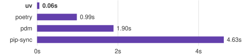

+++
title = "uv"
date = 2026-09-25T19:02:24+08:00
weight = 1
type = "docs"
description = ""
isCJKLanguage = true
draft = false
+++

> 原文链接: [https://docs.astral.sh/uv/](https://docs.astral.sh/uv/)

# uv

用 Rust 编写的极速 Python 包与项目管理器。



## 亮点

- 用一款工具替代 `pip`、`pip-tools`、`pipx`、`poetry`、`pyenv`、`twine`、`virtualenv` 等众多工具。
- 比 `pip` [快 10-100 倍](https://github.com/astral-sh/uv/blob/main/BENCHMARKS.md)。
- 提供[完善的项目管理](#projects)能力，并带有[通用锁文件](./concepts/projects/layout/#the-lockfile)。
- [运行脚本](#scripts)，支持[内联依赖元数据](./guides/scripts/#declaring-script-dependencies)。
- [安装和管理](#python-versions) Python 版本。
- [运行和安装](#tools)以 Python 包形式发布的工具。
- 包含一个 [pip 兼容接口](#the-pip-interface)，让你在熟悉的 CLI 上获得性能提升。
- 支持 Cargo 风格的[工作区](./concepts/projects/workspaces/)，适用于可扩展的项目。
- 磁盘空间高效，通过[全局缓存](./concepts/cache/)对依赖去重。
- 无需 Rust 或 Python 即可通过 `curl` 或 `pip` 安装。
- 支持 macOS、Linux 和 Windows。

uv 由 [Astral](https://astral.sh) 支持，他们也是 [Ruff](https://github.com/astral-sh/ruff) 的创造者。

## 安装

使用官方独立安装器安装 uv：



{}

```console
$ curl -LsSf https://astral.sh/uv/install.sh | sh
```

{}

{}

```pwsh
PS> powershell -ExecutionPolicy ByPass -c "irm https://astral.sh/uv/install.ps1 | iex"
```

{}



然后，查看[第一步](./getting-started/1.2-first-steps/)或继续阅读下面的简要概述。

> **提示**
>
> uv 也可以通过 pip、Homebrew 等方式安装。在[安装页面](./getting-started/1.1-installation/)上查看所有安装方式。

## 项目

uv 管理项目依赖和环境，支持锁文件、工作区等，与 `rye` 或 `poetry` 类似：

```console
$ uv init example
Initialized project `example` at `/home/user/example`

$ cd example

$ uv add ruff
Creating virtual environment at: .venv
Resolved 2 packages in 170ms
   Built example @ file:///home/user/example
Prepared 2 packages in 627ms
Installed 2 packages in 1ms
 + example==0.1.0 (from file:///home/user/example)
 + ruff==0.5.4

$ uv run ruff check
All checks passed!

$ uv lock
Resolved 2 packages in 0.33ms

$ uv sync
Resolved 2 packages in 0.70ms
Checked 1 package in 0.02ms
```

参见[项目指南](./guides/projects/)开始使用。

uv 也支持构建和发布项目，即使这些项目并非由 uv 管理。参见[打包指南](./guides/package/)了解更多。

## 脚本

uv 为单文件脚本管理依赖和环境。

创建一个新脚本，并添加声明其依赖的内联元数据：

```console
$ echo 'import requests; print(requests.get("https://astral.sh"))' > example.py

$ uv add --script example.py requests
Updated `example.py`
```

然后，在隔离的虚拟环境中运行该脚本：

```console
$ uv run example.py
Reading inline script metadata from: example.py
Installed 5 packages in 12ms
<Response [200]>
```

参见[脚本指南](./guides/scripts/)开始使用。

## 工具

uv 执行和安装由 Python 包提供的命令行工具，与 `pipx` 类似。

使用 `uvx`（`uv tool run` 的别名）在临时环境中运行工具：

```console
$ uvx pycowsay 'hello world!'
Resolved 1 package in 167ms
Installed 1 package in 9ms
 + pycowsay==0.0.0.2
  """

  ------------
< hello world! >
  ------------
   \   ^__^
    \  (oo)\_______
       (__)\       )\/\
           ||----w |
           ||     ||
```

用 `uv tool install` 安装工具：

```console
$ uv tool install ruff
Resolved 1 package in 6ms
Installed 1 package in 2ms
 + ruff==0.5.4
Installed 1 executable: ruff

$ ruff --version
ruff 0.5.4
```

参见[工具指南](./guides/tools/)开始使用。

## Python 版本

uv 安装 Python，并允许在版本之间快速切换。

安装多个 Python 版本：

```console
$ uv python install 3.10 3.11 3.12
Searching for Python versions matching: Python 3.10
Searching for Python versions matching: Python 3.11
Searching for Python versions matching: Python 3.12
Installed 3 versions in 3.42s
 + cpython-3.10.14-macos-aarch64-none
 + cpython-3.11.9-macos-aarch64-none
 + cpython-3.12.4-macos-aarch64-none
```

按需下载 Python 版本：

```console
$ uv venv --python 3.12.0
Using CPython 3.12.0
Creating virtual environment at: .venv
Activate with: source .venv/bin/activate

$ uv run --python pypy@3.8 -- python
Python 3.8.16 (a9dbdca6fc3286b0addd2240f11d97d8e8de187a, Dec 29 2022, 11:45:30)
[PyPy 7.3.11 with GCC Apple LLVM 13.1.6 (clang-1316.0.21.2.5)] on darwin
Type "help", "copyright", "credits" or "license" for more information.
>>>>
```

在当前目录中使用特定的 Python 版本：

```console
$ uv python pin 3.11
Pinned `.python-version` to `3.11`
```

参见[安装 Python 指南](./guides/install-python/)开始使用。

## pip 接口

uv 为常用的 `pip`、`pip-tools` 和 `virtualenv` 命令提供了可直接替换的实现。

uv 在它们的接口基础上扩展了高级特性，例如依赖版本覆盖、与平台无关的解析、可复现的解析、替代解析策略等。

使用 `uv pip` 接口，无需改变现有工作流即可迁移到 uv，并体验 10-100 倍的提速。

将 requirements 编译为与平台无关的 requirements 文件：

```console
$ uv pip compile requirements.in \
   --universal \
   --output-file requirements.txt
Resolved 43 packages in 12ms
```

创建虚拟环境：

```console
$ uv venv
Using CPython 3.12.3
Creating virtual environment at: .venv
Activate with: source .venv/bin/activate
```

安装已锁定的 requirements：

```console
$ uv pip sync requirements.txt
Resolved 43 packages in 11ms
Installed 43 packages in 208ms
 + babel==2.15.0
 + black==24.4.2
 + certifi==2024.7.4
 ...
```

参见 [pip 接口文档](./pip/)开始使用。

## 了解更多

参见[第一步](./getting-started/1.2-first-steps/)，或直接跳到[指南](./guides/)开始使用 uv。
