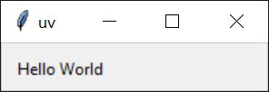
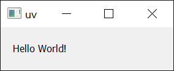

+++
title = "2.2 运行脚本"
date = 2026-09-25T19:02:24+08:00
weight = 2
type = "docs"
description = ""
isCJKLanguage = true
draft = false
+++

> 原文链接: [https://docs.astral.sh/uv/guides/scripts/](https://docs.astral.sh/uv/guides/scripts/)

# 2.2 运行脚本

Python 脚本是用于独立执行的文件，例如通过 `python <script>.py` 执行。使用 uv 执行脚本可以确保脚本依赖得到妥善管理，而无需手动管理环境。

> **注意**
>
> 如果你不熟悉 Python 环境：每个 Python 安装都有一个可以安装包的环境。通常建议创建[*虚拟*环境](https://docs.python.org/3/library/venv.html)，以隔离每个脚本所需的包。uv 会自动为你管理虚拟环境，并更倾向于用[声明式](#declaring-script-dependencies)方式管理依赖。

## 运行没有依赖的脚本

如果你的脚本没有依赖，可以直接用 `uv run` 执行：

```python
# example.py
print("Hello world")
```

```console
$ uv run example.py
Hello world
```

同样，如果你的脚本只依赖标准库中的模块，也无需做其他事情：

```python
# example.py
import os

print(os.path.expanduser("~"))
```

```console
$ uv run example.py
/Users/astral
```

可以向脚本传递参数：

```python
# example.py
import sys

print(" ".join(sys.argv[1:]))
```

```console
$ uv run example.py test
test

$ uv run example.py hello world!
hello world!
```

此外，你的脚本还可以直接从 stdin 读取：

```console
$ echo 'print("hello world!")' | uv run -
```

或者，如果你的 shell 支持 [here-document](https://en.wikipedia.org/wiki/Here_document)：

```bash
uv run - <<EOF
print("hello world!")
EOF
```

注意，如果你在*项目*（即包含 `pyproject.toml` 的目录）中使用 `uv run`，它会在运行脚本之前安装当前项目。如果你的脚本不依赖该项目，请使用 `--no-project` 标志跳过：

```console
$ # 注意：`--no-project` 标志必须放在脚本名之前。
$ uv run --no-project example.py
```

关于在项目中工作的更多细节，请参阅[项目指南](./2.4-projects/)。

## 运行带有依赖的脚本

当脚本需要其他包时，这些包必须安装到脚本运行所在的环境中。uv 更倾向于按需创建这些环境，而不是使用长期存在、需要手动管理依赖的虚拟环境。这要求显式声明脚本所需的依赖。通常建议使用[项目](./2.4-projects/)或[内联元数据](#declaring-script-dependencies)来声明依赖，不过 uv 也支持在每次调用时请求依赖。

例如，下面的脚本需要 `rich`。

```python
# example.py
import time
from rich.progress import track

for i in track(range(20), description="For example:"):
    time.sleep(0.05)
```

如果没有指定依赖就执行，这个脚本会失败：

```console
$ uv run --no-project example.py
Traceback (most recent call last):
  File "/Users/astral/example.py", line 2, in <module>
    from rich.progress import track
ModuleNotFoundError: No module named 'rich'
```

使用 `--with` 选项请求该依赖：

```console
$ uv run --with rich example.py
For example: ━━━━━━━━━━━━━━━━━━━━━━━━━━━━━━━━━━━━━━━━ 100% 0:00:01
```

如果需要特定版本，可以为请求的依赖添加约束：

```console
$ uv run --with 'rich>12,<13' example.py
```

可以重复使用 `--with` 选项来请求多个依赖。

注意，如果在*项目*中使用 `uv run`，这些依赖会*额外*包含在项目依赖之外。要退出该行为，请使用 `--no-project` 标志。

## 创建 Python 脚本

Python 最近新增了[内联脚本元数据](https://packaging.python.org/en/latest/specifications/inline-script-metadata/#inline-script-metadata)的标准格式。它允许选择 Python 版本并定义依赖。使用 `uv init --script` 可以初始化带有内联元数据的脚本：

```console
$ uv init --script example.py --python 3.12
```

## 声明脚本依赖

内联元数据格式允许在脚本自身中声明脚本的依赖。

uv 支持为你添加和更新内联脚本元数据。使用 `uv add --script` 声明脚本依赖：

```console
$ uv add --script example.py 'requests<3' 'rich'
```

这会在脚本顶部添加一个 `script` 段落，用 TOML 声明依赖：

```python
# example.py
# /// script
# dependencies = [
#   "requests<3",
#   "rich",
# ]
# ///

import requests
from rich.pretty import pprint

resp = requests.get("https://peps.python.org/api/peps.json")
data = resp.json()
pprint([(k, v["title"]) for k, v in data.items()][:10])
```

uv 会自动创建包含运行该脚本所需依赖的环境，例如：

```console
$ uv run example.py
[
│   ('1', 'PEP Purpose and Guidelines'),
│   ('2', 'Procedure for Adding New Modules'),
│   ('3', 'Guidelines for Handling Bug Reports'),
│   ('4', 'Deprecation of Standard Modules'),
│   ('5', 'Guidelines for Language Evolution'),
│   ('6', 'Bug Fix Releases'),
│   ('7', 'Style Guide for C Code'),
│   ('8', 'Style Guide for Python Code'),
│   ('9', 'Sample Plaintext PEP Template'),
│   ('10', 'Voting Guidelines')
]
```

> **重要**
>
> 使用内联脚本元数据时，即使 `uv run` [在*项目*中使用](../concepts/3.4.4-run/)，项目的依赖也会被忽略。此时无需 `--no-project` 标志。

uv 同样会遵循 Python 版本要求：

```python
# example.py
# /// script
# requires-python = ">=3.12"
# dependencies = []
# ///

# 使用 Python 3.12 新增的一些语法
type Point = tuple[float, float]
print(Point)
```

> **注意**
>
> 即使 `dependencies` 字段为空，也必须提供该字段。

`uv run` 会搜索并使用所需的 Python 版本。如果该 Python 版本尚未安装，它会自动下载 —— 更多细节请参阅 [Python 版本](../concepts/3.12-python-versions/)文档。

## 使用 shebang 创建可执行文件

添加 shebang 可以让脚本无需通过 `uv run` 即可执行 —— 这样就能方便地运行位于 `PATH` 或当前目录中的脚本。

例如，创建一个名为 `greet` 的文件，内容如下：

```python
#!/usr/bin/env -S uv run --script

print("Hello, world!")
```

确保脚本可执行，例如用 `chmod +x greet`，然后运行它：

```console
$ ./greet
Hello, world!
```

在这种场景下同样支持声明依赖，例如：

```python
#!/usr/bin/env -S uv run --script
#
# /// script
# requires-python = ">=3.12"
# dependencies = ["httpx"]
# ///

import httpx

print(httpx.get("https://example.com"))
```

## 使用替代包索引

如果你希望使用替代的[包索引](../concepts/3.5-indexes/)来解析依赖，可以通过 `--index` 选项提供索引：

```console
$ uv add --index "https://example.com/simple" --script example.py 'requests<3' 'rich'
```

这会把包索引数据写入内联元数据：

```python
# [[tool.uv.index]]
# url = "https://example.com/simple"
```

如果访问该包索引需要身份验证，请参阅[包索引](../concepts/3.5-indexes/)文档。

## 锁定依赖

uv 支持使用 `uv.lock` 文件格式为 PEP 723 脚本锁定依赖。与项目不同，脚本必须通过 `uv lock` 显式锁定：

```console
$ uv lock --script example.py
```

运行 `uv lock --script` 会在脚本旁边创建一个 `.lock` 文件（例如 `example.py.lock`）。

锁定之后，`uv run --script`、`uv add --script`、`uv export --script` 和 `uv tree --script` 等后续操作会复用已锁定的依赖，并在必要时更新锁文件。

如果不存在这样的锁文件，`uv export --script` 等命令仍能正常工作，但不会创建锁文件。

## 提高可复现性

除了锁定依赖之外，uv 还支持在内联脚本元数据的 `tool.uv` 段落中使用 `exclude-newer` 字段，以限制 uv 只考虑在特定日期之前发布的发行版。当你稍后再次运行脚本时，这有助于提高可复现性。

日期应使用 [RFC 3339](https://www.rfc-editor.org/rfc/rfc3339.html) 时间戳格式（例如 `2006-12-02T02:07:43Z`）。

```python
# example.py
# /// script
# dependencies = [
#   "requests",
# ]
# [tool.uv]
# exclude-newer = "2023-10-16T00:00:00Z"
# ///

import requests

print(requests.__version__)
```

## 使用不同的 Python 版本

uv 允许在每次调用脚本时请求任意的 Python 版本，例如：

```python
# example.py
import sys

print(".".join(map(str, sys.version_info[:3])))
```

```console
$ # 使用默认的 Python 版本，在你的机器上可能不同
$ uv run example.py
3.12.6
```

```console
$ # 使用指定的 Python 版本
$ uv run --python 3.10 example.py
3.10.15
```

关于请求 Python 版本的更多细节，请参阅 [Python 版本请求](../concepts/3.12-python-versions/#requesting-a-version)文档。

## 使用 GUI 脚本

在 Windows 上，`uv` 会使用 `pythonw` 运行以 `.pyw` 结尾的脚本：

```python
# example.pyw
from tkinter import Tk, ttk

root = Tk()
root.title("uv")
frm = ttk.Frame(root, padding=10)
frm.grid()
ttk.Label(frm, text="Hello World").grid(column=0, row=0)
root.mainloop()
```

```console
PS> uv run example.pyw
```



带依赖的脚本同样可以这样运行：

```python
# example_pyqt.pyw
import sys
from PyQt5.QtWidgets import QApplication, QWidget, QLabel, QGridLayout

app = QApplication(sys.argv)
widget = QWidget()
grid = QGridLayout()

text_label = QLabel()
text_label.setText("Hello World!")
grid.addWidget(text_label)

widget.setLayout(grid)
widget.setGeometry(100, 100, 200, 50)
widget.setWindowTitle("uv")
widget.show()
sys.exit(app.exec_())
```

```console
PS> uv run --with PyQt5 example_pyqt.pyw
```



## 后续步骤

要进一步了解 `uv run`，请参阅[命令参考](../reference/5.1-cli/#uv-run)。

或者继续阅读，了解如何用 uv [运行和安装工具](./2.3-tools/)。
